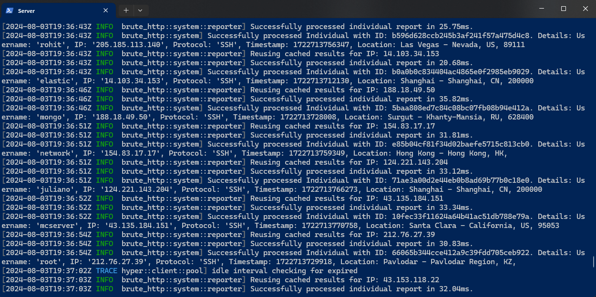

# Brute
[](https://github.com/notpointless/brute)
[](/)
[](https://github.com/notpointless/brute/releases/tag/v1.0.0)

Brute is a project for monitoring authentication attempts on servers using OpenSSH. It tracks and records each attempt
and provides detailed information about the person who made the attempt.

Currently, this project must use a specific version of OpenSSH. Unfortunately, the changes made to 
this may compromise the security of your server, so use with **caution**.

- **Straightforward** — Simply call the endpoint ```/brute/attack/add```, and Brute will log, analyze, and store the credentials for you.

- **Extendable Metrics** — Brute allows developers to easily add or remove metrics as needed. You can easily integrate additional metrics or connect an API with minimal effort to Brute.

- **Location Information** — Information can be easily accessed through the [Ipinfo](https://ipinfo.io//) API, which is integrated into Brute. This integration allows for retrieval of detailed data from the individual's IP address.

<div align="center">  </div>

## Setup
```sh
# Download rustup
curl https://sh.rustup.rs -sSf | sh

# Type 1 to proceed with the default installation.
# You might need to restart the shell

# Add Rust to PATH
source "$HOME/.cargo/env"

# Verify the installation
rustc -V
```

Non-docker installation
<details><summary><b>Show instructions</b></summary>

1. Clone the repository:

    ```sh
    git clone https://github.com/notpointless/brute
    ```
2. Go into the repository:
    ```sh
    cd brute-http
    ```
3. Set the following environment variables:
    ```env
    ##############
    # brute_http #
    ##############
    DATABASE_URL=postgresql://postgres:{password}@{host}/{database}
    BEARER_TOKEN=xxxxxxxxxxxxxxxxxxxxxxxxxxxxxxxxxxxx
    IPINFO_TOKEN=xxxxxxxxxxxxxx
    RUST_LOG=trace
    RUST_LOG_STYLE=always
    LISTEN_ADDRESS=0.0.0.0:7000
    LISTEN_ADDRESS_TLS=0.0.0.0:7443
    RUNNING_IN_DOCKER=false

    ################
    # brute_daemon #
    ################
    ADD_ATTACK_ENDPOINT=http://localhost:7000/brute/stats/attack
    ```
4. Add your cert.pem and key.pem to /certs folders:
    ```
    Generate one from cloudflare, letsencrypt or just use the openssl command.
    If you don't want to run with ssl then going into main.rs and remove serve_tls() function.
    ```
5. Build and run the program
    ```sh
    cargo build --release # then run executable or
    cargo run # run the program
    ```
</details>

Docker installation (TODO)
<details><summary><b>Show instructions</b></summary>
</details>

## Installation for Traffic
Before installing, please identify where you want to source your traffic. 
There are, of course, multiple ways to do this, but we'll only be discussing two of them.
- OpenSSH
- Daemon (Developing a custom daemon that listens on ports such as SSH, FTP, HTTP/HTTPS, LDAP, etc.)
```sh
# Update package lists
sudo apt update

# Upgrade all installed packages
sudo apt upgrade

# Install essential build tools and libraries
sudo apt install build-essential zlib1g-dev libssl-dev libpq-dev pkg-config

# Install additional development libraries
sudo apt install libcurl4-openssl-dev libpam0g-dev

# Install autoconf for configuration scripts
sudo apt install autoconf
```
### Daemon
Supports SSH and FTP. You can easily integrate your own protocols just call /brute/attack/add then specify the protocol in the payload. This is a great alternative if you don't want to go through the openssh route. But ensure that you use this on a dummy server not a production server. 
https://github.com/notpointless/brute-daemon

Please ensure you have OpenSSH and any FTP server uninstalled before proceeding.

<details><summary><b>Show instructions</b></summary>

1. Clone the repository:

    ```sh
    git clone https://github.com/notpointless/brute-daemon
    ```
2. Go into the repository:
    ```sh
    cd brute-daemon
    ```
3. Build the application:
    ```sh
    cargo build --release
    ```
4. Move the executable into <code>/usr/local/bin/</code>:
    ```sh
    mv ~/brute-daemon/target/release/brute-daemon /usr/local/bin/brute-daemon
    ```
5. Create a daemon file and paste and edit the following contents:
    ```sh
    nano /etc/systemd/system/brute-daemon.service
    ```
    ```diff
    +  [Unit]
    +  Description=Brute Daemon
    +  After=network.target

    +  [Service]
    +  ExecStart=/usr/local/bin/brute-daemon
    +  Restart=always
    +  User=root
    +  WorkingDirectory=/usr/local/bin
    +  StandardOutput=append:/var/log/brute-daemon.log
    +  StandardError=append:/var/log/brute-daemon_error.log

    +  # Environment Variables
    +  Environment="ADD_ATTACK_ENDPOINT=https://example.com/brute/attack/add"
    +  Environment="BEARER_TOKEN=my-secret-token"

    + [Install]
    + WantedBy=multi-user.target
    ```
6. Reload <code>systemd</code>:
    ```
    systemctl daemon-reload
    ```
7. Enable the service:
    ```
    systemctl enable brute-daemon
    ```
8. Start the service:
    ```
    systemctl start brute-daemon
    ```
8. Check the status and it should say the following:
    ```
    systemctl status brute-daemon
    ```
    ```
    Active: active (running) 
    ```
</details>

### OpenSSH
<details><summary><b>Show instructions</b></summary>

1. Clone the repository:

    ```sh
    git clone https://github.com/notpointless/openssh-9.8-patched
    ```

2. Go into the repository:

    ```sh
    cd openssh-9.8-patched
    ```

3. Configure the repository:

    ```sh
    autoreconf
    ./configure --with-pam --with-privsep-path=/var/lib/sshd/ --sysconfdir=/etc/ssh
    ```
4. Now make and install the server:
    ```sh
    make
    make install
    ```
5. Then go into <code>ssh.service</code>
    ```ssh
    nano /lib/systemd/system/ssh.service
    ```
6. Replace the existing SSH server with the one you just compiled:
    ```diff
    -  ExecStartPre=/usr/sbin/sshd -t
    -  ExecStart=/usr/sbin/sshd -D $SSHD_OPTS
    -  ExecReload=/usr/sbin/sshd -t
    +  ExecStartPre=/usr/local/sbin/sshd -t
    +  ExecStart=/usr/local/sbin/sshd -D $SSHD_OPTS
    +  ExecReload=/usr/local/sbin/sshd -t
    ```
7. Now run <code>ssh -V</code> and it should say the following:
    ```
    (Brute) OpenSSH_9.8...
    ```
</details>